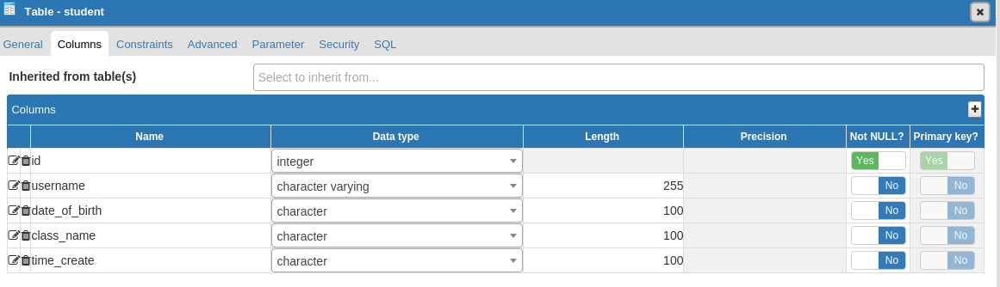

# Bài test công ty finsify
## Yêu cầu: Xây dựng 1 ứng dụng đơn giản có thể thêm, sửa, xóa, hiển thị danh sách các sinh viên.

# Ứng dụng sử dụng: 
* Expressjs làm server.
* Sử dụng template `nunjucks` để hiển thị front end.
* Database: Postgresql.
* Sử dụng Jquery để thay đổi dữ liệu hiển thị trên trang web.

# Chi tiết:
### Bảng `student` có các trường: id(integer auto increment), username(varchar), date_of_birth(varchar), class_name(varchar), time_create(varchar).

### Chia thư mục úng dụng thành:
* Folder `config`: chứa file cấu hình kết nối CSDL
* Folder `models`: chứa file truy vấn CSDL và trả dữ liệu.
* Folder `router`: chứa các router tương tác của ứng dụng.
* Folder `views`: chứa file hiển thị dữ liệu ra ngoài front end.
* File `index.js`: file chạy ứng dụng.

# Cách chạy ứng dụng:
* Tải CSDL postgresql về máy [tại đây](https://www.postgresql.org/download/). 
* Tạo CSDL trong postgresql với bảng student bên trên.

* Thay đổi cấu hình trong folder config.
* cd test-moneylover
* npm i
